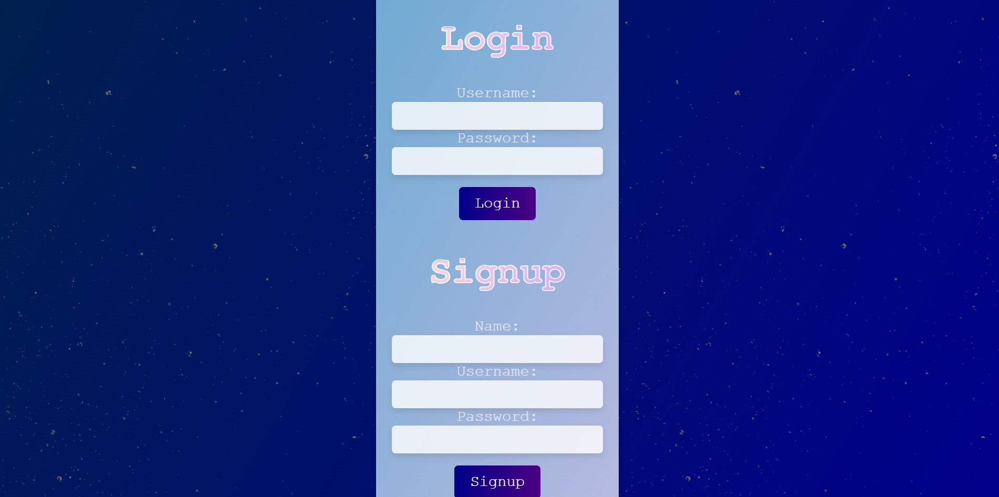
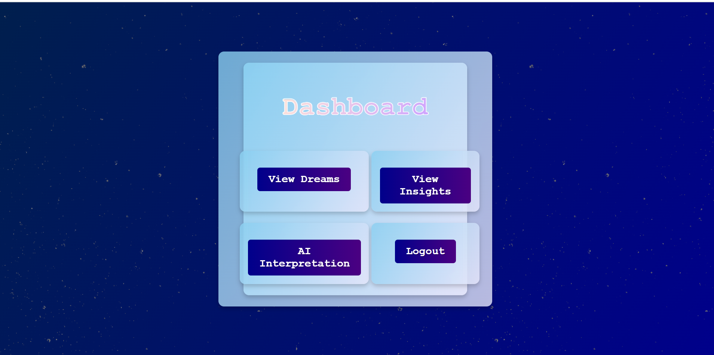
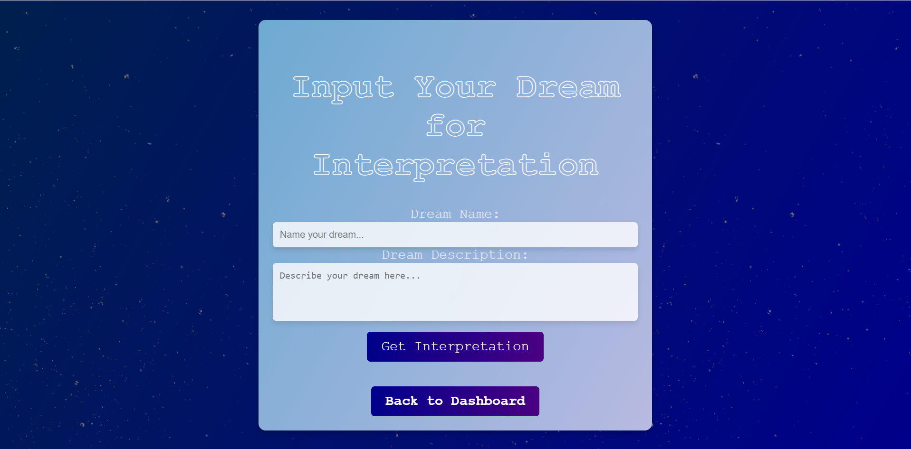

# DreamNet

## Description

DreamNet is a web application that allows users to log and manage their dreams, view AI-driven interpretations, and interact with their dream data. Built with Express.js and Sequelize for the backend, and Handlebars for dynamic HTML rendering, it features user authentication, session management, and CRUD operations for dreams. The project integrates OpenAI’s API for generating dream interpretations, offering users insights into their subconscious. It combines modern web technologies with an intuitive interface to provide a comprehensive platform for exploring and understanding dreams.

## Deployed Website

You can visit the deployed version of this application here: [DreamNet on Render](https://dreamnet-4.onrender.com/)

### Screenshots

#### Home Page

#### Login Page

#### Dashboard

#### AI Interpreter

## Table of Contents

- [Installation](#installation)
- [Usage](#usage)
- [Contributing](#contributing)
- [Tests](#tests)
- [License](#license)
- [Contact/Questions](#questions)
## Installation

To install and set up DreamNet, first clone the repository from GitHub and navigate into the project directory. Run npm install to install all required dependencies. Next, set up your database by creating a .env file with your database configuration and OpenAI API key. Run \i schema.sql to create the database, and npm run seed to populate it with initial data. Start the application with npm run dev and visit http://localhost:3001 in your browser to access the app. Make sure you have PostgreSQL and Node.js installed on your machine.

## Usage

DreamNet is a web application that allows users to manage their dreams, receive AI-generated interpretations, and view detailed insights. After logging in or registering, users can add and view their dreams, which are displayed in a user-friendly dashboard. From the dashboard, users can access various features including viewing their dreams, exploring AI interpretations, and navigating back to the dashboard. The application uses session-based authentication for secure access and provides real-time interaction with the database for dream management. To get started, simply navigate to the dashboard and use the provided forms to input dreams and view their interpretations.

## Contributing

Contributions to DreamNet are welcome and encouraged! To contribute, please fork the repository and create a pull request with your changes. Ensure that your code adheres to the project's coding standards and includes appropriate tests. Before submitting a pull request, make sure your changes are well-documented, and provide a clear description of the modifications or features added. If you are fixing a bug or adding a new feature, please include relevant issues or feature requests in your pull request description. For any questions or to discuss potential changes, open an issue in the repository to start a conversation with the maintainers.

## Tests

To test DreamNet using Insomnia, start by ensuring your server is running with npm start or node server.js. Open Insomnia and create new requests for each of the API endpoints, such as /api/users/login, /api/users/logout, /api/dreams, and /api/interpretations. For each endpoint, set the appropriate HTTP method (GET, POST, PUT, DELETE), include necessary headers (like Content-Type: application/json), and provide request body data as needed. Execute the requests to verify that they return the expected responses and interact correctly with your server. Inspect the returned data to ensure it matches your application's functionality and handle any errors or discrepancies as they arise.

## License

This project is licensed under the MIT license. Click [here](https://opensource.org/licenses/MIT) for more details.

## Contact/Questions

If you have any questions, please feel free to reach out to any of the following team members:

- **Tylor Barrios**: [tylerbarrios@gmail.com](mailto:tylerbarrios@gmail.com) | GitHub: [tylorbarrios](https://github.com/tylorbarrios)
- **Charles Demichele**: [demichele.charles@yahoo.com](mailto:demichele.charles@yahoo.com) | GitHub: [demichele-c](https://github.com/demichele-c)
- **Lily Ebadi**: [Lilly888_ebadi@yahoo.com](mailto:Lilly888_ebadi@yahoo.com) | GitHub: [lilyebadi](https://github.com/lilyebadi)
- **Erin Spix**: [e.spix@yahoo.com](mailto:e.spix@yahoo.com) | GitHub: [erinspix](https://github.com/erinspix)

